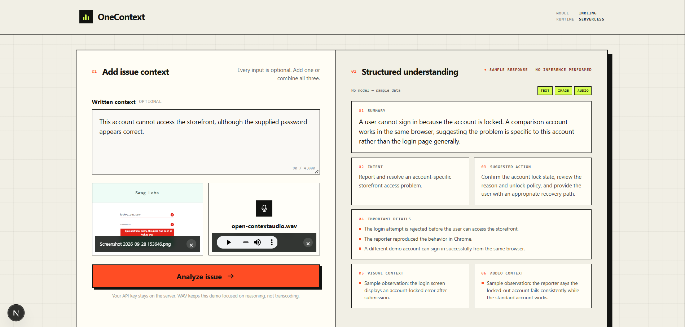

# OneContext

OneContext is a small Next.js and TypeScript demonstration of native multimodal
inference with Together AI Serverless.



## Main objective

The project demonstrates one technical idea:

> **OneContext does not transcribe audio first and then pass a transcript to another
> language model. Inkling receives the text, image, and audio together and reasons over
> them within the same multimodal model and inference call.**

Product and issue feedback is only the sample scenario. This is not a complete
issue-management product.

## Technical understanding

Multimodal applications are often built as several pipelines:

```text
Audio -> transcription model
Image -> vision model
Outputs -> language model
```

OneContext uses a natively multimodal model instead:

```text
Text + Image + Audio
          |
Next.js server route
          |
Together Serverless / thinkingmachines/Inkling
          |
Validated structured JSON
```

The browser sends a multipart form to the Next.js route. The route validates the files,
encodes the image and WAV audio, and sends the available modalities in one Together chat
completion request. The requested JSON structure is validated with Zod before it is sent
back to the browser.

## Structured result

```json
{
  "summary": "",
  "intent": "",
  "important_details": [],
  "visual_context": [],
  "audio_context": [],
  "suggested_action": ""
}
```

## Local setup

Requirements:

- Node.js 20.9 or newer
- npm
- A Together Project API key and credits for live inference

Install dependencies:

```bash
npm install
```

Copy the environment template:

```powershell
Copy-Item .env.example .env.local
```

Run the application:

```bash
npm run dev
```

Open [http://localhost:3000](http://localhost:3000).

## Environment variables

Live inference:

```env
TOGETHER_API_KEY=your_project_api_key
ONECONTEXT_DEMO_MODE=false
```

Never expose `TOGETHER_API_KEY` through a `NEXT_PUBLIC_` variable.

No-cost sample mode:

```env
ONECONTEXT_DEMO_MODE=true
```

Sample mode validates the form and returns a fixed example. It does not inspect the
uploaded content, call Together, or perform inference. The results panel labels this mode
clearly.

## Example input

- Text: `This account cannot access the storefront, although the supplied password appears correct.`
- Screenshot: a login page showing an account-locked error
- WAV note: the reporter explains that the problem occurs in Chrome while another account works

Accepted inputs:

- Text up to 4,000 characters
- PNG, JPEG, or WebP image up to 5 MB
- WAV audio up to 10 MB

WAV support is intentional. The purpose is to demonstrate native multimodal reasoning in
one inference call, not audio transcoding.

## Important limitations

- This is a technical demonstration, not a production issue-management system.
- It has no database, authentication, queues, agents, RAG, or persistent file storage.
- Sample mode returns fixed data and performs no AI inference.
- Live inference requires a valid Together Project API key and sufficient credits.
- Uploaded files are held only for the request, but deployment platforms may impose lower
  request-size limits.
- Model output can vary and must not be treated as verified facts without review.

## Verification

```bash
npm run typecheck
npm run lint
npm run build
```

The live model and API shape were selected from the current
[Together Inkling model page](https://www.together.ai/models/inkling) and
[Together structured-output documentation](https://docs.together.ai/docs/inference/chat/structured-outputs).
